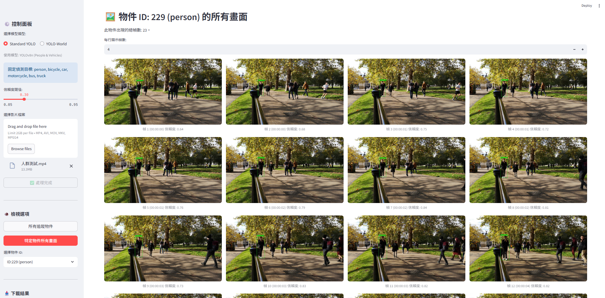

# Taoyuan Ethics

## Installization
1. Install python 
- https://www.python.org/downloads/
2. Install packages
- download [this repository](https://github.com/ugtony/TaoyuanEthics)
- open terminal in project folder "TaoyuanEthics" and execute
   `pip install -r requirements.txt`

This repository contains two programs:

1. **`detect_video.ipynb`**  
    A Jupyter Notebook demo.

2. **`detect_video_sreamlit.py`**  
    A streamlit website demo. 
    `streamlit run detect_video_streamlit.py`.  

We would like to express our sincere appreciation to [Pexels](https://www.pexels.com/) for the high-quality video footage that enhances this project.