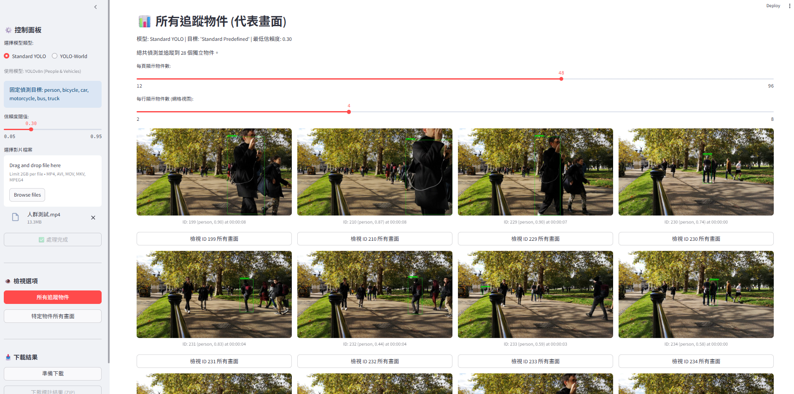

# Taoyuan Ethics

This repository contains three programs:

1. **`detect_video_streamlit.py`**  
    This program is designed to be executed as a Jupyter Notebook.

2. **`detect_video_sreamlit.py`**  
This is a Python script that is expected to be executed as a Streamlit program using the command `streamlit run detect_video_streamlit.py`.  
It is designed to detect people or vehicles, similar to the first program, but implemented in a Streamlit interface.

3. **`yolo_world_streamlit.py`**  
This is another Python script that is also expected to be executed as a Streamlit program using the command `streamlit run yolo_world_streamlit.py`.  
It utilizes the YOLO-World model to detect objects specified by the user.

We would like to express our sincere appreciation to [Pexels](https://www.pexels.com/) for the high-quality video footage that enhances this project.